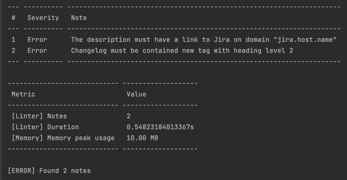

# Merge Request Linter


[](https://opensource.org/licenses/MIT)


This package provides tools for validating merge requests

[Show validation rules](docs/rules.md)

[Creating custom rule](docs/custom_rule.md)

## Installation

### Installation as Composer Dependency

You must have implementation of `psr/http-client-implementation`

* Run: `composer require --dev artarts36/merge-request-linter`
* Run `./vendor/bin/mr-linter install`. The file `.mr-linter.php` will be added to the root directory.
* Configure `.mr-linter.php`

### Installation via PHAR

* Download [PHAR](https://github.com/ArtARTs36/php-merge-request-linter/releases/latest/downloadmr-linter.phar)
* Run `mr-linter.phar install`. The file `.mr-linter.php` will be added.
* Configure `.mr-linter.php`

## Available Commands

| Command  | Description  |
| ------------ | ------------ |
| ./vendor/bin/mr-linter install  | Install this tool (copy configuration file to work directory)  |
| ./vendor/bin/mr-linter dump  | Print current rules  |
| ./vendor/bin/mr-linter lint  | Run lint to current merge request  |

## Usage

Add new script into your composer.json (section **scripts**):

```json
    "mr-lint": [
        "./vendor/bin/mr-linter lint"
    ]
```

### ➜ Usage with Gitlab CI

1. Generate token on `https://{gitlab-host}/-/profile/personal_access_tokens`
2. Open `https://{gitlab-host}/group/project/-/settings/ci_cd`. Add new variable "MR_LINTER_GITLAB_HTTP_TOKEN" with your personal access token
3. Add new step into **.gitlab-ci.yml**:
   ```yml
   mr-lint:
     stage: lint
     only:
       - merge_requests
     script:
       - composer mr-lint
   ```

### ➜ Usage with Github Actions

1. Generate token on [page](https://github.com/settings/tokens/new)
2. Open https://github.com/{owner}/{repo}/settings/secrets/actions/new. Add new secret "MR_LINTER_GITHUB_HTTP_TOKEN" with your personal access token
3. Add new step into **.github/workflows/workflow-name.yml**:
    ```yml
    - name: MR Lint
      env:
        MR_LINTER_GITHUB_HTTP_TOKEN: ${{ secrets.MR_LINTER_GITHUB_HTTP_TOKEN }}
      run: composer mr-lint
    ```

### Run in Docker

Simple bash:
```shell
docker run \
  -it \
  -e GITHUB_ACTIONS=1 \
  -e GITHUB_REPOSITORY=artarts36/php-merge-request-linter \
  -e GITHUB_GRAPHQL_URL=https://api.github.com/graphql \
  -e GITHUB_REF_NAME=${MR_ID}/merge \
  -e MR_LINTER_GITHUB_HTTP_TOKEN=${TOKEN} \
  -v "${PWD}/.mr-linter.json:/app/.mr-linter.json:ro" \
  artarts36/merge-request-linter:${MR_LINTER_VERSION} lint
```

## Development Commands

| Command            | Description                           |
|--------------------|---------------------------------------|
| composer test      | Run tests (via PHPUnit)               |
| composer lint      | Run lint (via PHPCsFixer)             |
| composer doc-rules | Build rules doc page                  |
| make try           | Run MR-Linter on really merge-request |

## Console output example


